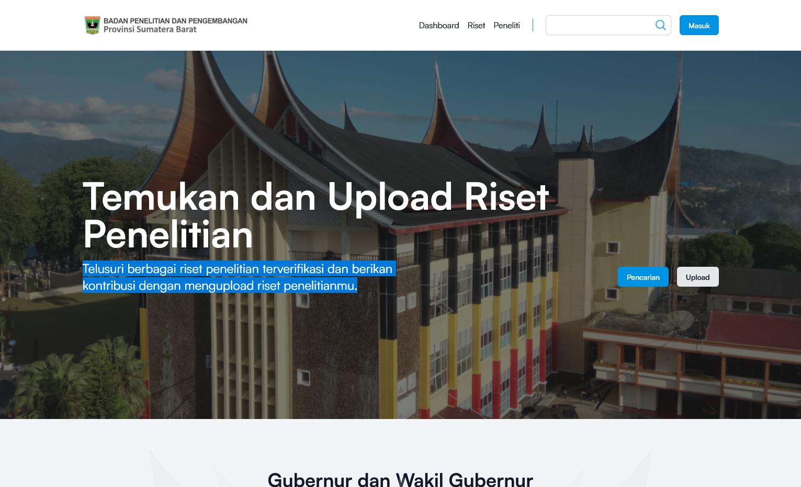

# E-Riset

Aplikasi ini manajemen riset penelitian Badan Penelitian dan Pengembangan Provinsi Sumatera Barat,
sebagai aplikasi web yang mendukung pengelolaan riset penelitian, publikasi, paten. Aplikasi ini menggunakan
framework Laravel dan menggunakan PostgreSQL sebagai database, frontend menggunakan Alpine.js dan Tailwind CSS.

## Tech Stack

<span>
    
    
    
</span>

## Features

- Manajemen data peneliti
- Manajemen data riset penelitian
- Manajemen data publikasi
- Manajemen data paten
- Localization (Bahasa Indonesia)

## Screenshots



## Requirements

- PHP 8.1+
- Composer
- PostgreSQL
- Node.js + NPM
- Alpine.js
- Tailwind CSS

## Run Locally

1. Clone repository dan masuk ke direktori project

```bash
git clone https://github.com/ryanedikastudy/Laravel-E-Riset.git
cd Laravel-E-Riset
```

2. Install dependensi Composer dan Node.js

```bash
composer install
npm install
```

3. Copy file `.env.example` ke `.env`

```bash
cp .env.example .env
```

4. Buka project menggunakan VSCode

```bash
code .
```

5. Siapkan PostgreSQL environment variable, lakukan perubahan di file `.env`

```bash
DB_CONNECTION=pgsql
DB_HOST={host database}
DB_PORT={port database}
DB_DATABASE={nama database}
DB_USERNAME={username database}
DB_PASSWORD={password database}
```

6. Sesuaikan nama project di `.env` dan set debug mode ke `true` selama proses development

```bash
APP_NAME={nama project}
APP_ENV=local
APP_KEY=
APP_DEBUG=true
APP_URL=http://localhost
```

7. Generate key

```bash
php artisan key:generate
```

8. Migrate database

```bash
php artisan migrate
```

9. Seed database (Optional)

```bash
php artisan db:seed
```

10. Link storage

```bash
php artisan storage:link
```

11. Jalankan development artisan server

```bash
php artisan serve
```

12. Jalankan vite server

```bash
npm run dev
```

13. Buka browser dan masuk ke url `http://localhost:8000`
